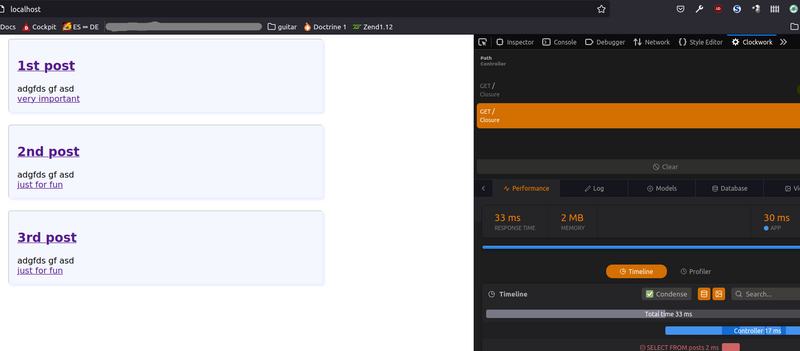
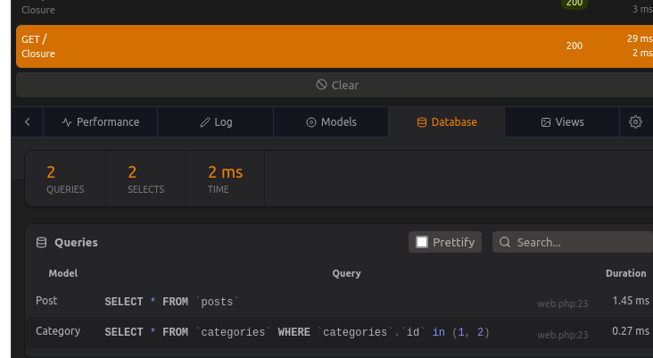

Laravel 8 from scratch

Notes on the laracasts course of the same name

<!-- START doctoc generated TOC please keep comment here to allow auto update -->
<!-- DON'T EDIT THIS SECTION, INSTEAD RE-RUN doctoc TO UPDATE -->
**Table of Contents**

- [Prerequisites and Setup](#prerequisites-and-setup)
  - [Introdution to MVC in Laravel](#introdution-to-mvc-in-laravel)
  - [Initial environment setup](#initial-environment-setup)
  - [EXKURS: html/css/tailwind workshop for blog design](#exkurs-htmlcsstailwind-workshop-for-blog-design)
- [The basics](#the-basics)
  - [Simple routes](#simple-routes)
  - [Including CSS and JS](#including-css-and-js)
  - [Storing blog posts as html](#storing-blog-posts-as-html)
  - [Route wildcards](#route-wildcards)
  - [Caching](#caching)
  - [Use a model and Filesystem class to read a directory](#use-a-model-and-filesystem-class-to-read-a-directory)
  - [Adding Metadata to posts](#adding-metadata-to-posts)
- [The Blade templating engine](#the-blade-templating-engine)
  - [Basics](#basics)
  - [Layouts](#layouts)
    - [Option 1 - Layout files](#option-1---layout-files)
    - [Option 2 - blade components](#option-2---blade-components)
    - [Tweaks for the blog app](#tweaks-for-the-blog-app)
- [Working with Databases](#working-with-databases)
  - [Environment files](#environment-files)
  - [Migrations](#migrations)
  - [Eloquent ORM and the active record pattern](#eloquent-orm-and-the-active-record-pattern)
  - [Make a Post model and migration](#make-a-post-model-and-migration)
  - [Route model binding](#route-model-binding)
  - [The first eloquent relationship](#the-first-eloquent-relationship)
  - [Clockwork and the N+1 problem](#clockwork-and-the-n1-problem)
  - [Database seeding (saves time)](#database-seeding-saves-time)
  - [Turbo boost with factories](#turbo-boost-with-factories)
  - [Posts by author and other housekeeping stuff](#posts-by-author-and-other-housekeeping-stuff)
  - [Eager loading relationships on an existing model](#eager-loading-relationships-on-an-existing-model)
- [Integrate the design](#integrate-the-design)
  - [AlpineJS Exkurs](#alpinejs-exkurs)

<!-- END doctoc generated TOC please keep comment here to allow auto update -->

# Prerequisites and Setup

## Introdution to MVC in Laravel

Request (URL call from browser) 
    -> laravel app is loaded
    -> registered response is loaded from `routes.php`, e.g. `Route::get('/', [PizzaController::class, 'index']);`
    -> Controller delegates SQL queries to eloquent model; Controller is also the place for domain knowledge / business logic 
    -> view is loaded (e.g. `index.blade.php`), receives the data from the controller and displays it

## Initial environment setup

`Laravel Sail` is a docker container and command line app with everything needed for developing in laravel.

Install  [(other ways described here)] (https://laravel.com/docs/8.x/installation) with `curl -s https://laravel.build/example-app | bash` (Linux) in the directory where the project should be located. Docker must be installed for this to work. `example app` can be any name, the `laravel.build` URL just returns a shell script with the name given in the URL that is passed to bash with the above command.

To run the app and access it under localhost:  

    cd example-app
    ./vendor/bin/sail up

[upgrade docker-compose](https://stackoverflow.com/questions/49839028/how-to-upgrade-docker-compose-to-latest-version) if you get an error on `sail up`

On first start, this will take some time.

Best add an alias `alias sail='bash vendor/bin/sail` to the `.bashrc`.

**Important** To use composer and laravel tools, prefix them with `sail` so the right php version is assumed, e.g. `sail composer require laravel/sanctum`

Another way, if php / DB are installed locally, is using the [laravel installer using composer](https://laravel.com/docs/8.x/installation#installation-via-composer). 

## EXKURS: html/css/tailwind workshop for blog design

CSS frameworks are an abomination

# The basics

## Simple routes

Web routes are defined `routes/web.php`, views under `resources/views`. Routes don't have to use / return a view. Some route examples:

    Route::get('/peer', function () {
        return view('peer'); // view file = resources/views/peer.blade.php
    });

    Route::get('/noview', function () {
        return "hey hey my my"; // returns just that, no view file necessary
    });

    Route::get('/givemesomejson', function () {
        // this array gets automatically converted to JSON
        return ['here' => ['you', 'have', 'some', 'json']];
    });
    
    // $title and $post will be availabe in the view
    Route::get('post', function () {
        return view('post', [
            'title' => '1st post!!!',
            'post' => 'hello world'
        ]);
    });

## Including CSS and JS

The css / js files and folders in `resources` are meant to be compiled / bundled, so we ignore these for now and put the css we use directly under `public/app.css` and `app.js` and include them in the html as we would in any static page.

## Storing blog posts as html

In the next step, we store the posts as individual html files in resources/posts and use their name as a slug we append to the URL. The commands `dd` and `ddd` are debug commands built in laravel (dump and die (dd) ...and debug (ddd)).

## Route wildcards

A slug / parameter can be checked by using `->where(paramName, regex)` instead of checking it in the route function that returns a 404 if it doesn't match.

    Route::get('post/{post}', function ($slug) {
        $path = __DIR__ . '/../resources/posts/' . $slug . '.html';
        if (!file_exists($path)) {
            //ddd('file does not exist'); // dump, die and debug
            //abort(404);
            return redirect('/');
        }
        $post = file_get_contents($path);
        return view('post', [
            'post' => $post
        ]);
    })->where('post', '[A-z_\-]+'); // letters, underscores and dashes

Additional predefined `whereX` methods are defined such as `whereAlpha(variableName)`, which is the same as `where('post', '[A-z]+')`.

## Caching

Output can easily be cached:

    $path = __DIR__ . '/../resources/posts/' . $slug . '.html';
    $post = cache()->remember("posts.{$slug}", 5, function () use ($path) {
        return file_get_contents($path);
    });

The first parameter is any unique key, here we're using the extrapolated route (e.g. "post.my-fine-post" will always return the content of the my-dine-post.html file). The second parameter is the duration the result should be cached in seconds, other ways would be e.g. `now()->addMinutes(20)`.

## Use a model and Filesystem class to read a directory

The logic for looking up and loading a post can be put into a model (app/Models). The `cache()` function etc. work there as well.
Laravel also provides various filesystem path functions like `app_path` or `ressource_path` (see usage below);

File app/Models/Post.php:

    namespace App\Models;
    
    class Post
    {
        public static function find($slug) {
    
            if(!file_exists($path=resource_path("posts/${slug}.html"))) {
                // redirect('/'); // the method shouldn't be responsible for redirecting
                throw new ModelNotFoundException();
            }
    
            return cache()->remember("posts.{$slug}", 1, function() use ($path) {
                return file_get_contents($path);
            });
        }
    }

The ModelNotFoundException doesn't indicate that the Post class isn't found but that a record isn't found (it extends `RecordsNotFoundException`, which makes this clearer).

To add a method to get all existing posts, we can use Laravels File facade class (`use Illuminate\Support\Facades\File`). As there are several, make sure to select the right one.

File app/Models/Post.php:

    public static function all() {
        // File::allFiles returns an array of SplFileInfo objects
        return array_map(function ($file) {
            // we could also just use $file->getContents(), but the find method might do something
            // necessary before returning it in the future
            return self::find($file->getFilenameWithoutExtension());
        }, File::allFiles(resource_path('posts')));
    }

## Adding Metadata to posts

File metadata for the posts can be added with the [yaml-front-matter](https://github.com/spatie/yaml-front-matter) package. 

After installing this (`composer require spatie/yaml-front-matter` or `vendor/bin/`sail composer require spatie/yaml-front-matter when using sail) this, we can add metadata that we can read / use to the html files of the individual posts.

File `resources/posts/my-first-post.html`:

    ---
    title: 1st post!1!!
    excerpt: agga gf dsgfdasfga
    date: 2021.12.24
    ---
    
    
Lorem ipsum dolor sit amet, consectetur adipisicing elit. A, amet cumque deserunt esse est excepturi molestiae odit sequi ut veniam....

We can then add properties and a constructor to the `Post` model:

    class Post
    {
        public $title;
        public $excerpt;
        public $date;
        public $body;
        public $slug;
    
        /**
         * @param $title
         * @param $excerpt
         * @param $date
         * @param $body
         */
        public function __construct($title, $excerpt, $date, $body, $slug)
        {
            $this->title = $title;
            $this->excerpt = $excerpt;
            $this->date = $date;
            $this->body = $body;
            $this->slug = $slug;
        }
        // ...

In the `all` in the `Post` model method, we can create and return new Posts. Laravel provides a collection function that provides many methods such as map, each, filter and many more. One of the main advantages is the fluent interface instead of wrapping multiple `array_map`s. 

    public static function all()
    {
        return collect(File::files(resource_path("posts")))
            ->map(function ($file) {
                return YamlFrontMatter::parseFile($file);
            })
            ->map(function ($yfm) {
                return new Post(
                    $yfm->matter('title'),
                    $yfm->matter('excerpt'),
                    $yfm->matter('date'),
                    $yfm->body(),
                    $yfm->matter('slug'),
                );
            });
    }

In the `find` method we can now use the `all()` method to return a post by its slug. The laravel collection class provides methods such as `firstWhere` here to select the first item in a collection with a property matching a certain value. This could be done with `filter` as well but `firstWhere` is more terse.

    public static function find($slug)
    {
        return cache()->remember("posts.{$slug}", 5, function () use ($slug) {
            return self::all()->firstWhere('slug', $slug);
        });
    }

Laravel collections has several sort methods. We can also use the cache to cache a result "forever", meaning until we manually or programmatically update it.

    public static function all()
    {
        return cache()->rememberForever('posts.all', function () {
            return collect(File::files(resource_path("posts")))
                ->map(function ($file) {
                    return YamlFrontMatter::parseFile($file);
                })
                ->map(function ($yfm) {
                    return new Post(
                        $yfm->matter('title'),
                        $yfm->matter('excerpt'),
                        $yfm->matter('date'),
                        $yfm->body(),
                        $yfm->matter('slug'),
                    );
                })
                ->sortBy('date', SORT_REGULAR, true);
        });
    }

To update the cache, we can use the `php artisan tinker` (or `sail artisan tinker` when using sail) shell using `cache()->forget('posts.all')`. This can of course be done in the app / cron job as well.

    pk@pk-lightshow:~/projects/php/laravel/laravel8_from_scratch/blog$ sail artisan tinker
    Psy Shell v0.10.12 (PHP 8.1.0 — cli) by Justin Hileman
    >>> cache('posts.all') # view cache
    => Illuminate\Support\Collection {#3503
         all: [
           2 => App\Models\Post {#3499
             +title: "3rd post!1!!",
            # etc...
    >>> cache()->forget('posts.all') # clears cache
        => true
 
Cache items can also be viewed with `cache()->get(keyname)`, or set with `cache()->put(key, val)` or just `cache([key=>val], optionalDurationInSeconds)`.

The Model might not be a good place to read the filesystem, so it might be a good idea to put that into a Serviceprovider (`app/Providers`). We will not do that here / now.

# The Blade templating engine

## Basics

While PHP can still be used in the templates, it has also a template language that makes writing views more comfortable. So instead of writing `<?php echo $post->title; ?>` we can just write `{{ $post->title }}`. The `.blade.php` file suffix is required for the blade tags to be parsed.

In `storage/framework/views` you can see the compiled pure php versions of the blade views.

By default, the piped variables shown with `{{ var }}` are escaped, so contained tags appear as normal text. To show them unescaped, use `{!! var !!}`.

Control structures such as `foreach` can be used by adding an `@` in front ("blade directives").

    @foreach($posts as $post)
        <article>
            <a href="/post/{{ $post->slug }}"> <h1>{{ $post->title }}</h1></a>
            
{{ $post->excerpt }}

        </article>
    @endforeach

This translates to 

    <?php $__currentLoopData = $posts; $__env->addLoop($__currentLoopData); foreach($__currentLoopData as $post): $__env->incrementLoopIndices(); $loop = $__env->getLastLoop(); ?>
    <article>
        <a href="/post/<?php echo e($post->slug); ?>"> <h1><?php echo e($post->title); ?></h1></a>
        
<?php echo e($post->excerpt); ?>

    </article>
    <?php endforeach; $__env->popLoop(); $loop = $__env->getLastLoop(); ?>

This means that the created `$loop` variable is accessible in blade and can e.g. be shown with `@dd($loop)`. This **also** means that you can't define your own variable named `$loop` here.

Example `@dd($loop)` output:

    {#293 ▼
      +"iteration": 1
      +"index": 0
      +"remaining": 3
      +"count": 4
      +"first": true
      +"last": false
      +"odd": true
      +"even": false
      +"depth": 1
      +"parent": null
    }

The `$loop` properties can be useful for conditional formating in the html by checking for "->last", "->odd" or "->even".

Blade also has convenience flow control keywords such as `@unless / @endunless` as the opposite of `@if`.

Comments in blade: `{{-- my useful comment --}}`

## Layouts

Layouts (to avoid repetitive HTML boilerplate code in each view) can be defined in 2 ways.

### Option 1 - Layout files

Create a `layout.blade.php` (the name is not important) in the `views` directory and add one or many `@yield` directives where the content of the other views should go (`content` in the example is arbitrary):

layout.blade.php:

    <!doctype html>
    <html lang="de">
    <head>
        <meta charset="UTF-8">
        <meta name="viewport"
              content="width=device-width, user-scalable=no, initial-scale=1.0, maximum-scale=1.0, minimum-scale=1.0">
        <meta http-equiv="X-UA-Compatible" content="ie=edge">
        <title>My awesome blog</title>
        <link rel="stylesheet" href="/app.css">
        
    </head>
    <body>
    @yield('content')
    </body>
    </html>

post.blade.php:

    @extends('layout')
    
    @section('content')
    <article>
        <h1>{{ $post->title }}</h1>
        {!! $post->body !!}
    </article>
    <a href="/">Go back</a>
    @endsection

### Option 2 - blade components

Blade components allow to wrap html. To create them, create a `components` directory under `views`. The name of the directory is NOT arbitrary and must be `components`. Once created, the components created in there are immediately available.

Here is a simple example. `$slot` is a non-arbitrary name of the default content that is wrapped in `<x-viewName></x-viewName>` tags in the views.

views/components/myPrettyLayout.blade.php

    <!doctype html>
    <html lang="de">
    <head>
        ...
    </head>
    <body>
    {{ $slot }}
    </body>
    </html>

views/post.blade.php

    <x-myPrettyLayout>
    <article>
        <h1>{{ $post->title }}</h1>
        {!! $post->body !!}
    </article>
    <a href="/">Go back</a>
    </x-myPrettyLayout>

 Both ways to create layout template approaches are equal.
 
Components don't have to be just a html scaffold but can also be used for single components such as buttons, similar to react components.

### Tweaks for the blog app

- we remove the route constraint (`->where(...`) in `routes/web.php` as we shouldn't need it anymore the way we find the slug
- now, when we append an non-existing slug, we get an error page as the model returns `null` as it doesn't find a post with that name. The view still gets rendered but as $post is null, it produces an error.
- A common pattern is to create a `find` and a `findOrFail` method in the model:

models/Post.php

    public static function find($slug)
    {
            return static::all()->firstWhere('slug', $slug);
    }

    public static function findOrFail($slug) {
        $post = static::find($slug);
            if(! $post) {
                throw new ModelNotFoundException();
            }

            return $post;
    }

The exception returns a 404 to the user.

# Working with Databases

## Environment files

The usual `.env` file stuff, accessed with `env(settingName, defaultValue)` in laravel. DB settings are set up there.

With `sail`, you can log into mysql with `sail mysql -u root -p`.

Users are root/(no password) and sail/"password".

The mysql database is also accessible on the host system on the usual port 3306.

**From here, I will not prefix any laravel or container related commands with `sail` anymore as it is implied if you use sail!**

## Migrations

To do an initial database setup for the up, use `artisan migrate` that sets up the basic system tables such as `users`, `password_resets` etc.
These migrations are defined in `database/migrations`.

The methods defined in the migrations `up` and `down` are to apply and reverse the migrations (database setups like table creation) respectively.

    /**
     * Run the migrations.
     *
     * @return void
     */
    public function up()
    {
        Schema::create('users', function (Blueprint $table) {
            $table->id();
            $table->string('name');
            $table->string('email')->unique();
            $table->timestamp('email_verified_at')->nullable();
            $table->string('password');
            $table->rememberToken();
            $table->timestamps();
        });
    }

    /**
     * Reverse the migrations.
     *
     * @return void
     */
    public function down()
    {
        Schema::dropIfExists('users');
    }

When changing these files, roll back the migrations (`php artisan migrate:rollback`) and reapply them.

To drop all tables and redo all migragions, use `migrage:fresh`. When setting `APP_ENV=production` in `.env`, a warning is issued before applying destructive migrations.

## Eloquent ORM and the active record pattern

Each table can have a corresponding eloquent model. In the active record pattern, an object instance is tied to a single row of the corresponding table.

A user using the default User model can be created on the command line with `tinker`:

    pk@pk-lightshow:~/projects/php/laravel/laravel8_from_scratch/blog$ sail artisan tinker
    Psy Shell v0.10.12 (PHP 8.1.0 — cli) by Justin Hileman
    >>> $user = new User;
    [!] Aliasing 'User' to 'App\Models\User' for this Tinker session.
    => App\Models\User {#3504}
    >>> $user->name = 'pk';
    => "pk"
    >>> $user->email = 'pk@example.com'
    => "pk@example.com"
    >>> $user->password = bcrypt('test123');
    => "$2y$10$l35.izzm3T7kTaXL5ewVL.JBesWFVJDq0eE/M2o8lqa9FCrxHtX.i"
    >>> $user->save();
    => true

**Important:** when making changes in the model, tinker must be restarted for them to be recognized!

We can also use all the default model / collections methods here.

    >>> User::find(2);
    => App\Models\User {#4231
        id: 2,
        name: "pk",
        email: "pk@example.com",
        email_verified_at: null,
        #password: "$2y$10$l35.izzm3T7kTaXL5ewVL.JBesWFVJDq0eE/M2o8lqa9FCrxHtX.i",
        #remember_token: null,
        created_at: "2021-12-27 15:47:28",
        updated_at: "2021-12-27 15:47:28",
    }
    >>> User::all()->pluck('name'); // only one user so far
    => Illuminate\Support\Collection {#4297
         all: [
           "pk",
         ],
       }

## Make a Post model and migration

Deleting the file based model we created, we use `artisan` to create a new Migration (table definition) and Model using `php artisan make:migration` and `...make:model` respectively.

Side note: to get help on specific artisan commands, prefix them with `help`, e.g. `php artisan help make:migration`.

    pk@pk-lightshow:~/projects/php/laravel/laravel8_from_scratch/blog$ sail artisan make:migration create_posts_table
    Created Migration: 2021_12_27_182411_create_posts_table

Artisan guesses from the _table in the migration name that it should create a table and creates a minimal migration file under `database/migrations`.

Here we can add the fields we need:

    // ...
    public function up()
    {
        Schema::create('posts', function (Blueprint $table) {
            $table->id(); // generated by artisan
            $table->timestamps(); // generated by artisan
            $table->string('slug'); 
            // rest added by us
            $table->string('title');
            $table->text('excerpt');
            $table->text('body');
            $table->timestamp('published')->nullable();
        });
    }
    // ...

We can then run migrate to create the actual table in the DB:

    pk@pk-lightshow:~/projects/php/laravel/laravel8_from_scratch/blog$ sail artisan migrate
    Migrating: 2021_12_27_182411_create_posts_table
    Migrated:  2021_12_27_182411_create_posts_table (29.23ms)

Then we can auto-create the Model (The model name should be the singular version of the table name by convention):

    pk@pk-lightshow:~/projects/php/laravel/laravel8_from_scratch/blog$ sail artisan make:model Post
    Model created successfully.

We can now create a post with tinker the same way we created a user before or we can create a new Post by using mass assignment.

    >>> use App\Models\Post;
    >>> Post::create(['title' => 'My third post', 'slug' => 'my-third-post', 'excertpt' => 'test123', 'body' => 'It was a long winter night befor solstice']);
    Illuminate\Database\Eloquent\MassAssignmentException with message 'Add [title] to fillable property to allow mass assignment on [App\Models\Post].'

Laravel throws an error because we need to explicitly define in the model which fields are allowed to be mass assigned ("mass assigning" meaning to fill all the attributes of an entry in bulk):

    # added as property to Post model
    protected $fillable = ['title'];

After restarting tinker, we will still get a (confusing) error:

    >>> Post::create(['title' => 'My third post', 'slug' => 'my-third-post', 'excertpt' => 'test123', 'body' => 'It was a long winter night befor solstice']);
    Illuminate\Database\QueryException with message 'SQLSTATE[HY000]: General error: 1364 Field 'slug' doesn't have a default value (SQL: insert into `posts` (`title`, `updated_at`, `created_at`) values (My third post, 2021-12-27 18:56:41, 2021-12-27 18:56:41))'

This is caused by only `title` being assigned as fillable, so the other passed attributes are ignored and Eloquent tries to use the defaults for the missing fields, which for most don't exist / aren't defined in the migration, so we must add all fields that should be mass assignable to the $fillable property.

The opposite to `$fillable` is `$guarded` which, if set, signals to Eloquent that all properties are fillable EXCEPT the ones defined in the `$guarded` array, e.g. `$guarded = ['id', 'created']`.

A third option is to disable mass assignment entirely by setting $fillable to an empty array (and simply to never do mass assignment in the code).

## Route model binding

In the route, we can simplify the route by indicating a type of `Post` in the callback and Laravel will bind the route key to an underlying eloquent model:

Before:

    Route::get('post/{id}', function ($id) {
        // Find a post by it's id and pass it to a view called post
        return view('post', ['post' => Post::findOrFail($id)]);
    });

After:

    Route::get('post/{post}', function (Post $post) {
        return view('post', ['post' => $post]);
    });

Important: the variable name in the route MUST match with the parameter name, so this would NOT work:

    Route::get('post/{foo}', function (Post $post) {
        return view('post', ['post' => $foo]);
    });

By default, this expects / uses the ID of the model as the route parameter. We can very simply change that to use any model field, here we use slug:

    Route::get('post/{post:slug}', function (Post $post) {
        return view('post', ['post' => $post]);
    });

If 2 routes are defined, the last one is the one evaluated, so selecting by id will NOT work anymore if we have both routes:

    Route::get('post/{post}', function (Post $post) {
        return view('post', ['post' => $post]);
    });
    
    Route::get('post/{post:slug}', function (Post $post) {
        return view('post', ['post' => $post]);
    });

If the slug will always be the identifier for a model, we can also leave it as before (using only `{post}` instead of `{post:slug}`) and instead add a method called `getRouteKeyName()` to the model:

    public function getRouteKeyName()
    {
        return 'slug'; // TODO: Change the autogenerated stub
    }

For older laravel versions, the latter is the only working approach.

## The first eloquent relationship

To make a categories model so that we can assign categories to blog posts, we could use 

    php artisan make:migration create_categories_table
    php artisan make:model

but we can do this in one step by adding `-m` to make:model (we could also create a controller with `-c` and `-f` to create a factory):

    php artisan make:model Category -m

We can now add our fields to the created migration ('name' and 'slug', where slug is optional) and add a foreign key to the posts migragtion:

Categories migration:

    $table->string('name');
    $table->string('slug')->unique(); // if name != slug

Posts migration:

    $table->foreignId('category_id');

Then run `php artisan migrate:refresh`. We can now use tinker to create categories and posts:

    >>> $cat = new App\Models\Category
    >>> $cat->name="very important"; $cat->slug="important";
    >>> $cat->save();
    >>> $cat = new App\Models\Category
    >>> $cat->name="just for fun"; $cat->slug="fun"; $cat->save();
    >>> Post::create(['title' => '3rd post', 'excerpt'=>'adgfds  gf asd', 'body'=>'dgf asfsdfa fdsgfdhjg eoruitgh gf ghfghfdlk g', 'slug'=>'my-third-post', 'category_id' => 2]);

We can now change the Model so we can show the category of a given post (the full category entry, not just the foreign category_id). The method name is important and must be the same as the model name, unless we specify a second argument for `belongsTo`. See [Posts by author and other housekeeping stuff](#posts-by-author-and-other-housekeeping-stuff))

Models/Post.php

    public function category()
    {
        return $this->belongsTo(Category::class);
    }

Possible relationship methods are: hasOne, hasMany, belongsTo, belongsToMany

More explanation of hasMany vs belongsToMany [here](https://stackoverflow.com/questions/36208460/hasmany-vs-belongstomany-in-laravel-5-x).

We can now use this method *as a property* (not as a method):

    >>> $p->category
    => App\Models\Category {#4229
         id: 1,
         name: "very important",
         slug: "important",
         created_at: "2021-12-28 10:28:38",
         updated_at: "2021-12-28 10:28:38",
       }

We can use this in the view, e.g.  `<a href="#">{{ $post->category->name }}</a>`

We can add a route showing all posts belonging to a category by adding a `posts` method (name arbitrary but using the plural of the model makes sense) to the category model:

Models/Category

    public function posts() {
        return $this->hasMany(Post::class);
    }

routes/web.php

    Route::get('categories/{category:slug}', function(Category $category) {
        return view('posts', ['posts' => $category->posts]);
    });

## Clockwork and the N+1 problem

Problem: At the moment, we're performing a sql query in every loop iteration as the posts are not automatically hydrated / filled with the category entry of the relationship but only on access.

views/posts.blade.php

    @foreach($posts as $post)
        ...
        <a href="/categories/{{$post->category->slug}}">{{ $post->category->name }}</a>
    @endforeach

We can log the queries using Illuminates DB facade in the main route:

    Route::get('/', function () {
        \Illuminate\Support\Facades\DB::listen(function($query) {
            //\Illuminate\Support\Facades\Log::info('query executed');
            //or, shorter
            logger($query->sql, $query->bindings);
        });
        return view('posts', ['posts' => Post::all()]);
    });

When checking `storage/logs/laravel.log` we can see that for one page load of `/` we have one sql query for each post after the initial (lazy) loading of all posts in the route:

    [2021-12-28 12:54:33] local.DEBUG: select * from `posts`  
    [2021-12-28 12:57:46] local.DEBUG: select * from `categories` where `categories`.`id` = ? limit 1 [1] 
    [2021-12-28 12:57:46] local.DEBUG: select * from `categories` where `categories`.`id` = ? limit 1 [2] 
    [2021-12-28 12:57:46] local.DEBUG: select * from `categories` where `categories`.`id` = ? limit 1 [2] 

Side note: a good debugging tool is [clockwork](https://underground.works/clockwork/) which gives access to performance and other information under `/clockwork` or in as a tab in the browser devtools. Clockwork must be installed with composer in the application **and** as a [browser plugin](https://addons.mozilla.org/en-US/firefox/addon/clockwork-dev-tools/)

To solve the n+1 problem, we load all the categories in the initial loading of posts in the route using `with`:

    return view('posts', ['posts' => Post::with('category')->get()]);

No we can see (in the log or with clockwork) that only 2 queries are executed, no matter how many posts:

## Database seeding (saves time)

As we're changing and refining the models during development (e.g. adding a foreign key `user_id` to the posts migration), the database refresh always drops and recreates all tables so that the current data is lost.

In `database/seeders/DatabaseSeeder.php` we can seed the database with initial records. In there is already a (commented out) setup for 10 fake users using `database/factories/UserFactory.php`, which uses [faker](https://github.com/fzaninotto/Faker) to create fake data. We can run this with `artisan db:seed` to create 10 user records (and 10 more on any subsequent run).

We can change `DatabaseSeeder.php` for our needs (we've added a foreign user_id key in the posts migration).

database/seeders/DatabaseSeeder.php

    public function run()
    {
        // remove existing data so we don't get an exception when trying to insert
        // the same value in a unique column
        Category::truncate();
        User::truncate();
        Post::truncate();
      
        // create one user with the already existing factory
        $user = User::factory()->create();

        // create 2 categories (we don't have a factory for these yet)
        $fun = Category::create([
            'name' => 'fun stuff',
            'slug' => 'fun'
        ]);
        $serious = Category::create([
           ...
        ]);
        ...

        Post::create([
            'title' => 'Spray apache pool strength lying visited. ',
            'slug' => 'my-first-post',
            'body' => 'Lorem ipsum dolor sit amet, consectetur adipiscing elit, sed do eiusmod tempor incididunt ut labore et dolore magna aliqua. Ut enim ad minim veniam, quis nostrud exercitation ullamco laboris nisi ut aliquip ex ea commodo consequat. Duis aute irure dolor in reprehenderit in voluptate velit esse cillum dolore eu fugiat nulla pariatur. Excepteur sint occaecat cupidatat non proident, sunt in culpa qui officia deserunt mollit anim id est laborum.',
            'excerpt' => 'abc 1234 i am an expert in excerpts',
            'category_id' => $fun->id,
            'user_id' => $user->id
        ]);

        Post::create([
            ...
        ]);

        ...
    }

We can then refresh the database and seed it in one go with `artisan migrate:fresh --seed`.

Side note: if we want to display the user in the views and avoid, yet again, unnecessary DB queries in each iteration, we must add `user` to the `with` clause in the route:

## Turbo boost with factories

Each generated eloquent model comes with `use HasFactory` that gives access to a factory function (see `User::factory()->create()`). The attributes will be created in the `definition` method of the modeos factory located in the `database/factories` directory, named ModelnameFactory.php, e.g. `UserFactory.php`. The factory method itself doesn't need to be defined by hand.

Example of the ' definition` method in the predefined UserFactory:

    public function definition()
    {
        return [
            'name' => $this->faker->name(),
            'email' => $this->faker->unique()->safeEmail(),
            'email_verified_at' => now(),
            'password' => '$2y$10$92IXUNpkjO0rOQ5byMi.Ye4oKoEa3Ro9llC/.og/at2.uheWG/igi', // password
            'remember_token' => Str::random(10),
        ];
    }

As long as no factory class exists in `database/factories`, an error will occur when trying to use `Modelname::factory()->create()`. We can generate a factory with artisan:

  `php artisan make:factory PostFactory`

Alternatively, we can create a factory when creating the model:

    php artisan make:model Category -f # or --factory

Side note: we can create everything in one go by using `-a` or `--all`. See all options in `artisan help make:model`.

`faker` can be accessed as a property of `$this` in the factory class.

After we created the PostFactory, we can fill in the `definition` methods body:

      return [
            'title' => $this->faker->title(),
            'excerpt' => $this->faker->sentence(),
            'slug' => $this->faker->unique()->slug(3),
            'body' => $this->faker->paragraph(),
            'published' => $this->faker->dateTimeBetween('-10 days'),
            // don't forget to import these, e.g. use App\Models\Category;
            // these create a random category / user for each post
            'category_id' => Category::factory(), // we created this as well
            'user_id' => User::factory(),
        ];

We can try this out with tinker:

    >>> App\Models\Post::factory()->create();
    => App\Models\Post {#3611
         title: "Prof.",
         excerpt: "Quia sit et consequatur alias id.",
         slug: "molestias-ratione-perspiciatis-quis",
         body: "Odit tempora alias aliquid nobis aliquam non maiores. Ipsam sunt autem unde quidem dolor laboriosam. Ullam vero voluptatem voluptas sed et provident vel ipsam. Tempora molestias dolores ipsum eos ut sequi.",
         category_id: 4,
         user_id: 2,
         updated_at: "2021-12-28 18:51:46",
         created_at: "2021-12-28 18:51:46",
         id: 4,
       }

No we can remove all the hand-creation in `DatabaseSeeder.php` (or leave some in if specific, non-random Posts / users / categories should be created) and just call `Post::factory(10)->create();` instead to create 10 posts with users / categories.

If we want to assign specific non-random values, we can do so by passing the key and value to create:

    User::factory()->create(['name' => 'John Doe']);

This can be used to make the data generation a little more "realistic":

    // create 6 posts in 2 different categories by the same user
    $pk = User::factory()->create(['name' => 'PKRO']);
    $fun = Category::factory()->create(['name'=>'fun stuff', 'slug' => 'fun']);
    $serious = Category::factory()->create(['name'=>'serious stuff', 'slug' => 'serious']);
    Post::factory(3)->create(['user_id' => $pk->id, 'category_id' => $fun->id]);
    Post::factory(3)->create(['user_id' => $pk->id, 'category_id' => $serious->id]);
    // create 5 more of everything, random
    Post::factory(5)->create();

## Posts by author and other housekeeping stuff

We can easily get results for Posts by using `latest`; under the hood, eloquent will add an `order by` statement.

    Post::latest('published')->with(['category', 'user'])->get()

To change the way we refer to semantically refer to a posts author as author and not (just) user, we can add a second argument to `belongsTo`:

    // we just keep that so code that still refers to ->user doesn't break
    public function user()
    {
        // possible: hasOne, hasMany, belongsTo, belongsToMany
        return $this->belongsTo(User::class);
    }

    // this way we can refer to the autor as Post->author, note the second
    // argument in belongsTo
    public function author()
    {
        // possible: hasOne, hasMany, belongsTo, belongsToMany
        return $this->belongsTo(User::class, 'user_id');
    }

When we add properties this way, we must add them to the `with` method in `web.php` to avoid lazy loading (multiple sql queries for each post to get the author): `...with(['category', 'user', 'author'])...`, even if author / user refer to the same page.

To add a route to view all posts by author name, we can simply reuse the posts view. As The user's name is not unique (there can be multiple "Paul Smith"), we will add a new field `username` in the User migration and seeder factory, then refresh and reseed with `sail artisan migrate:fresh --seed` as usual.

routes/web.php

    Route::get('authors/{author:username}', function(User $author) {
        return view('posts', ['posts' => $author->posts]);
    });

## Eager loading relationships on an existing model

In the category and author overview we don't eagerly load author and category yet, leading to an additional query for every displayed post again. We can fix that by adding the load method to the posts property:

    return view('posts', ['posts' => $author->posts->load(['category', 'author'])]);

Another way to accomplish this would be to add the models that should *always* be eagerly loaded to the Post model:

    // this would always eagerly load the linked models
    //protected $with = ['category', 'author'];

You could then add `without` for queries where you **don't** want eager loading, e.g. `Post::without()->first()`.

# Integrate the design

Just some notes as I'm not planning to use the design and images as it uses tailwind and doesn't have a license file in the repo.

Short notes on design integration:

- extract post "cards" HTML for the overview pages in it's own blade component (`views/components/post-card.blade.php`)
- refer to them with `<x-post-card />` (no dynamic data yet) in the posts overview.
- If certain posts (e.g. the last 3) should have a different layout, do the same in e.g. `post-featured-card.blade.php`
- move bigger / complicated parts into their own components or partials. Partials are blade snippets that can be put in views (or any subdirectory) and included in the by< using `@include`, e.g. `@include('_posts-header')` (**don't add `.blade.php`!), which simply translates to php `include` when compiled. 
- variables can be passed to components with `<x-postCard :post=$post />`; In the course `@props(['post'])` is added at the top of the component, but seems to work without (?)

> explanation by ikartik90 [here](https://laracasts.com/series/laravel-8-from-scratch/episodes/32): I tried this out, and turns out that if you don't provide @props but still pass them to your Blade component, it takes the passed props (say, the $post variable in this case) and appends them as attributes on the first element of the component (the article tag in the above case).  
 Hence, once rendered, the generated code looks like:  
`<article class="whatever classes passed" post="$post JSON object">`  
And then it uses the above JSON object passed as attribute to the parent to render the content in the children.  
But in doing so, even though it ends up preventing your web app from crashing and burning, everything you've fetched using your $post variable including any eager loaded relationships would get exposed, including their respective record IDs. Hence, I would rather suggest exercising on the side of caution and ensuring that you pass the props diligently.
- html attributes like `<x-postCard class="postCard" id="myId">` can be passed into components and accessed using the `$attributes` variable in the component, e.g. `<article {{ $attributes->merge(['class' => 'anotherclass']) }}>`, which would translate to `<article class="anotherClass postCard" id="myId">`
- Timestamps have a method that makes it easy to convert them to strings like "one hour ago": `$post->created_at->diffForHumans()`
- Instead of `$category->id === $currentCategory->id` you can write `$category->is($currentCategory)`
## AlpineJS Exkurs

[AlpineJS](https://alpinejs.dev/)

[IntelliJ Alpine plugin](https://plugins.jetbrains.com/plugin/15251-alpine-js-support)

AlpineJS allows for declarative and reactive javascript functionality similar to vue.js with a 6kb include.

See `_header.blade.php` for an example of a javascript pulldown using alpine.js (included from a cdn):

      

          <button
              @click="show = !show"
              @click.away="show = false">
              
                  {{ isset($currentCategory) ? ucwords($currentCategory->name) : 'Category' }}
              ▽
          </button>
          <!-- setting display to none in the css file causes this to never show - why? -->
          

              @foreach($categories as $category)
                  @unless(isset($currentCategory) && $category->is($currentCategory))
                      <a href="/categories/{{$category->slug}}">{{ucwords($category->name)}}</a>
                  @endunless
              @endforeach
          

      

Side note: `defer` in a script tag means it should be loaded in parallel but executed after the page is loaded.

- Routes can be named (`->name('home')`) and accessed in view (`request()->routeIs('home')`). This can be useful for checking which menu item to set to active / style differently.

The alpinejs functionality can be further isolated into it's own component:

dropdown.blade.php

    

        

    
            {{-- trigger element, which can be anything --}}
            {{ $trigger }}
        

        <!-- setting display to none in the css file causes this to never show - why? -->
        

            {{-- links --}}
            {{ $slot }}
        

    

_header.blade.php

    <x-dropdown>
        <x-slot name="trigger">
            <button>
                 
                    {{ isset($currentCategory) ? ucwords($currentCategory->name) : 'Category' }}
                
                ▽
            </button>
        </x-slot>

        {{-- this goes into the default {{$slot}} --}}
        <x-slot name="slot">
        @foreach($categories as $category)
            @unless(isset($currentCategory) && $category->is($currentCategory))
                <a href="/categories/{{$category->slug}}">{{ucwords($category->name)}}</a>
            @endunless
        @endforeach
        </x-slot>
    </x-dropdown>