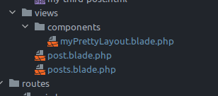

Laravel 8 from scratch

Notes on the laracasts course of the same name

<!-- START doctoc generated TOC please keep comment here to allow auto update -->
<!-- DON'T EDIT THIS SECTION, INSTEAD RE-RUN doctoc TO UPDATE -->
**Table of Contents**

- [Prerequisites and Setup](#prerequisites-and-setup)
  - [Introdution to MVC in Laravel](#introdution-to-mvc-in-laravel)
  - [Initial environment setup](#initial-environment-setup)
  - [EXKURS: html/css/tailwind workshop for blog design](#exkurs-htmlcsstailwind-workshop-for-blog-design)
- [The basics](#the-basics)
  - [Simple routes](#simple-routes)
  - [Including CSS and JS](#including-css-and-js)
  - [Storing blog posts as html](#storing-blog-posts-as-html)
  - [Route wildcards](#route-wildcards)
  - [Caching](#caching)
  - [Use a model and Filesystem class to read a directory](#use-a-model-and-filesystem-class-to-read-a-directory)
  - [Adding Metadata to posts](#adding-metadata-to-posts)
- [The Blade templating engine](#the-blade-templating-engine)
  - [Basics](#basics)
  - [Layouts](#layouts)
    - [Option 1 - Layout files](#option-1---layout-files)
    - [Option 2 - blade components](#option-2---blade-components)
    - [Tweaks for the blog app](#tweaks-for-the-blog-app)
- [Working with Databases](#working-with-databases)
  - [Environment files](#environment-files)
  - [Migrations](#migrations)
  - [Eloquent ORM and the active record pattern](#eloquent-orm-and-the-active-record-pattern)
  - [Make a Post model and migration](#make-a-post-model-and-migration)

<!-- END doctoc generated TOC please keep comment here to allow auto update -->

# Prerequisites and Setup

## Introdution to MVC in Laravel

Request (URL call from browser) 
    -> laravel app is loaded
    -> registered response is loaded from `routes.php`, e.g. `Route::get('/', [PizzaController::class, 'index']);`
    -> Controller delegates SQL queries to eloquent model; Controller is also the place for domain knowledge / business logic 
    -> view is loaded (e.g. `index.blade.php`), receives the data from the controller and displays it

## Initial environment setup

`Laravel Sail` is a docker container and command line app with everything needed for developing in laravel.

Install  [(other ways described here)] (https://laravel.com/docs/8.x/installation) with `curl -s https://laravel.build/example-app | bash` (Linux) in the directory where the project should be located. Docker must be installed for this to work. `example app` can be any name, the `laravel.build` URL just returns a shell script with the name given in the URL that is passed to bash with the above command.

To run the app and access it under localhost:  

    cd example-app
    ./vendor/bin/sail up

[upgrade docker-compose](https://stackoverflow.com/questions/49839028/how-to-upgrade-docker-compose-to-latest-version) if you get an error on `sail up`

On first start, this will take some time.

Best add an alias `alias sail='bash vendor/bin/sail` to the `.bashrc`.

**Important** To use composer and laravel tools, prefix them with `sail` so the right php version is assumed, e.g. `sail composer require laravel/sanctum`

Another way, if php / DB are installed locally, is using the [laravel installer using composer](https://laravel.com/docs/8.x/installation#installation-via-composer). 

## EXKURS: html/css/tailwind workshop for blog design

CSS frameworks are an abomination

# The basics

## Simple routes

Web routes are defined `routes/web.php`, views under `resources/views`. Routes don't have to use / return a view. Some route examples:

    Route::get('/peer', function () {
        return view('peer'); // view file = resources/views/peer.blade.php
    });

    Route::get('/noview', function () {
        return "hey hey my my"; // returns just that, no view file necessary
    });

    Route::get('/givemesomejson', function () {
        // this array gets automatically converted to JSON
        return ['here' => ['you', 'have', 'some', 'json']];
    });
    
    // $title and $post will be availabe in the view
    Route::get('post', function () {
        return view('post', [
            'title' => '1st post!!!',
            'post' => 'hello world'
        ]);
    });

## Including CSS and JS

The css / js files and folders in `resources` are meant to be compiled / bundled, so we ignore these for now and put the css we use directly under `public/app.css` and `app.js` and include them in the html as we would in any static page.

## Storing blog posts as html

In the next step, we store the posts as individual html files in resources/posts and use their name as a slug we append to the URL. The commands `dd` and `ddd` are debug commands built in laravel (dump and die (dd) ...and debug (ddd)).

## Route wildcards

A slug / parameter can be checked by using `->where(paramName, regex)` instead of checking it in the route function that returns a 404 if it doesn't match.

    Route::get('post/{post}', function ($slug) {
        $path = __DIR__ . '/../resources/posts/' . $slug . '.html';
        if (!file_exists($path)) {
            //ddd('file does not exist'); // dump, die and debug
            //abort(404);
            return redirect('/');
        }
        $post = file_get_contents($path);
        return view('post', [
            'post' => $post
        ]);
    })->where('post', '[A-z_\-]+'); // letters, underscores and dashes

Additional predefined `whereX` methods are defined such as `whereAlpha(variableName)`, which is the same as `where('post', '[A-z]+')`.

## Caching

Output can easily be cached:

    $path = __DIR__ . '/../resources/posts/' . $slug . '.html';
    $post = cache()->remember("posts.{$slug}", 5, function () use ($path) {
        return file_get_contents($path);
    });

The first parameter is any unique key, here we're using the extrapolated route (e.g. "post.my-fine-post" will always return the content of the my-dine-post.html file). The second parameter is the duration the result should be cached in seconds, other ways would be e.g. `now()->addMinutes(20)`.

## Use a model and Filesystem class to read a directory

The logic for looking up and loading a post can be put into a model (app/Models). The `cache()` function etc. work there as well.
Laravel also provides various filesystem path functions like `app_path` or `ressource_path` (see usage below);

File app/Models/Post.php:

    namespace App\Models;
    
    class Post
    {
        public static function find($slug) {
    
            if(!file_exists($path=resource_path("posts/${slug}.html"))) {
                // redirect('/'); // the method shouldn't be responsible for redirecting
                throw new ModelNotFoundException();
            }
    
            return cache()->remember("posts.{$slug}", 1, function() use ($path) {
                return file_get_contents($path);
            });
        }
    }

The ModelNotFoundException doesn't indicate that the Post class isn't found but that a record isn't found (it extends `RecordsNotFoundException`, which makes this clearer).

To add a method to get all existing posts, we can use Laravels File facade class (`use Illuminate\Support\Facades\File`). As there are several, make sure to select the right one.

File app/Models/Post.php:

    public static function all() {
        // File::allFiles returns an array of SplFileInfo objects
        return array_map(function ($file) {
            // we could also just use $file->getContents(), but the find method might do something
            // necessary before returning it in the future
            return self::find($file->getFilenameWithoutExtension());
        }, File::allFiles(resource_path('posts')));
    }

## Adding Metadata to posts

File metadata for the posts can be added with the [yaml-front-matter](https://github.com/spatie/yaml-front-matter) package. 

After installing this (`composer require spatie/yaml-front-matter` or `vendor/bin/`sail composer require spatie/yaml-front-matter when using sail) this, we can add metadata that we can read / use to the html files of the individual posts.

File `resources/posts/my-first-post.html`:

    ---
    title: 1st post!1!!
    excerpt: agga gf dsgfdasfga
    date: 2021.12.24
    ---
    
    
Lorem ipsum dolor sit amet, consectetur adipisicing elit. A, amet cumque deserunt esse est excepturi molestiae odit sequi ut veniam....

We can then add properties and a constructor to the `Post` model:

    class Post
    {
        public $title;
        public $excerpt;
        public $date;
        public $body;
        public $slug;
    
        /**
         * @param $title
         * @param $excerpt
         * @param $date
         * @param $body
         */
        public function __construct($title, $excerpt, $date, $body, $slug)
        {
            $this->title = $title;
            $this->excerpt = $excerpt;
            $this->date = $date;
            $this->body = $body;
            $this->slug = $slug;
        }
        // ...

In the `all` in the `Post` model method, we can create and return new Posts. Laravel provides a collection function that provides many methods such as map, each, filter and many more. One of the main advantages is the fluent interface instead of wrapping multiple `array_map`s. 

    public static function all()
    {
        return collect(File::files(resource_path("posts")))
            ->map(function ($file) {
                return YamlFrontMatter::parseFile($file);
            })
            ->map(function ($yfm) {
                return new Post(
                    $yfm->matter('title'),
                    $yfm->matter('excerpt'),
                    $yfm->matter('date'),
                    $yfm->body(),
                    $yfm->matter('slug'),
                );
            });
    }

In the `find` method we can now use the `all()` method to return a post by its slug. The laravel collection class provides methods such as `firstWhere` here to select the first item in a collection with a property matching a certain value. This could be done with `filter` as well but `firstWhere` is more terse.

    public static function find($slug)
    {
        return cache()->remember("posts.{$slug}", 5, function () use ($slug) {
            return self::all()->firstWhere('slug', $slug);
        });
    }

Laravel collections has several sort methods. We can also use the cache to cache a result "forever", meaning until we manually or programmatically update it.

    public static function all()
    {
        return cache()->rememberForever('posts.all', function () {
            return collect(File::files(resource_path("posts")))
                ->map(function ($file) {
                    return YamlFrontMatter::parseFile($file);
                })
                ->map(function ($yfm) {
                    return new Post(
                        $yfm->matter('title'),
                        $yfm->matter('excerpt'),
                        $yfm->matter('date'),
                        $yfm->body(),
                        $yfm->matter('slug'),
                    );
                })
                ->sortBy('date', SORT_REGULAR, true);
        });
    }

To update the cache, we can use the `php artisan tinker` (or `sail artisan tinker` when using sail) shell using `cache()->forget('posts.all')`. This can of course be done in the app / cron job as well.

    pk@pk-lightshow:~/projects/php/laravel/laravel8_from_scratch/blog$ sail artisan tinker
    Psy Shell v0.10.12 (PHP 8.1.0 — cli) by Justin Hileman
    >>> cache('posts.all') # view cache
    => Illuminate\Support\Collection {#3503
         all: [
           2 => App\Models\Post {#3499
             +title: "3rd post!1!!",
            # etc...
    >>> cache()->forget('posts.all') # clears cache
        => true
 
Cache items can also be viewed with `cache()->get(keyname)`, or set with `cache()->put(key, val)` or just `cache([key=>val], optionalDurationInSeconds)`.

The Model might not be a good place to read the filesystem, so it might be a good idea to put that into a Serviceprovider (`app/Providers`). We will not do that here / now.

# The Blade templating engine

## Basics

While PHP can still be used in the templates, it has also a template language that makes writing views more comfortable. So instead of writing `<?php echo $post->title; ?>` we can just write `{{ $post->title }}`. The `.blade.php` file suffix is required for the blade tags to be parsed.

In `storage/framework/views` you can see the compiled pure php versions of the blade views.

By default, the piped variables shown with `{{ var }}` are escaped, so contained tags appear as normal text. To show them unescaped, use `{!! var !!}`.

Control structures such as `foreach` can be used by adding an `@` in front ("blade directives").

    @foreach($posts as $post)
        <article>
            <a href="/post/{{ $post->slug }}"> <h1>{{ $post->title }}</h1></a>
            
{{ $post->excerpt }}

        </article>
    @endforeach

This translates to 

    <?php $__currentLoopData = $posts; $__env->addLoop($__currentLoopData); foreach($__currentLoopData as $post): $__env->incrementLoopIndices(); $loop = $__env->getLastLoop(); ?>
    <article>
        <a href="/post/<?php echo e($post->slug); ?>"> <h1><?php echo e($post->title); ?></h1></a>
        
<?php echo e($post->excerpt); ?>

    </article>
    <?php endforeach; $__env->popLoop(); $loop = $__env->getLastLoop(); ?>

This means that the created `$loop` variable is accessible in blade and can e.g. be shown with `@dd($loop)`. This **also** means that you can't define your own variable named `$loop` here.

Example `@dd($loop)` output:

    {#293 ▼
      +"iteration": 1
      +"index": 0
      +"remaining": 3
      +"count": 4
      +"first": true
      +"last": false
      +"odd": true
      +"even": false
      +"depth": 1
      +"parent": null
    }

The `$loop` properties can be useful for conditional formating in the html by checking for "->last", "->odd" or "->even".

Blade also has convenience flow control keywords such as `@unless / @endunless` as the opposite of `@if`.

## Layouts

Layouts (to avoid repetitive HTML boilerplate code in each view) can be defined in 2 ways.

### Option 1 - Layout files

Create a `layout.blade.php` (the name is not important) in the `views` directory and add one or many `@yield` directives where the content of the other views should go (`content` in the example is arbitrary):

layout.blade.php:

    <!doctype html>
    <html lang="de">
    <head>
        <meta charset="UTF-8">
        <meta name="viewport"
              content="width=device-width, user-scalable=no, initial-scale=1.0, maximum-scale=1.0, minimum-scale=1.0">
        <meta http-equiv="X-UA-Compatible" content="ie=edge">
        <title>My awesome blog</title>
        <link rel="stylesheet" href="/app.css">
        
    </head>
    <body>
    @yield('content')
    </body>
    </html>

post.blade.php:

    @extends('layout')
    
    @section('content')
    <article>
        <h1>{{ $post->title }}</h1>
        {!! $post->body !!}
    </article>
    <a href="/">Go back</a>
    @endsection

### Option 2 - blade components

Blade components allow to wrap html. To create them, create a `components` directory under `views`. The name of the directory is NOT arbitrary and must be `components`. Once created, the components created in there are immediately available.

Here is a simple example. `$slot` is a non-arbitrary name of the default content that is wrapped in `<x-viewName></x-viewName>` tags in the views.

views/components/myPrettyLayout.blade.php

    <!doctype html>
    <html lang="de">
    <head>
        ...
    </head>
    <body>
    {{ $slot }}
    </body>
    </html>

views/post.blade.php

    <x-myPrettyLayout>
    <article>
        <h1>{{ $post->title }}</h1>
        {!! $post->body !!}
    </article>
    <a href="/">Go back</a>
    </x-myPrettyLayout>

 Both ways to create layout template approaches are equal.
 
Components don't have to be just a html scaffold but can also be used for single components such as buttons, similar to react components.

### Tweaks for the blog app

- we remove the route constraint (`->where(...`) in `routes/web.php` as we shouldn't need it anymore the way we find the slug
- now, when we append an non-existing slug, we get an error page as the model returns `null` as it doesn't find a post with that name. The view still gets rendered but as $post is null, it produces an error.
- A common pattern is to create a `find` and a `findOrFail` method in the model:

models/Post.php

    public static function find($slug)
    {
            return static::all()->firstWhere('slug', $slug);
    }

    public static function findOrFail($slug) {
        $post = static::find($slug);
            if(! $post) {
                throw new ModelNotFoundException();
            }

            return $post;
    }

The exception returns a 404 to the user.

# Working with Databases

## Environment files

The usual `.env` file stuff, accessed with `env(settingName, defaultValue)` in laravel. DB settings are set up there.

With `sail`, you can log into mysql with `sail mysql -u root -p`.

Users are root/(no password) and sail/"password".

The mysql database is also accessible on the host system on the usual port 3306.

**From here, I will not prefix any laravel or container related commands with `sail` anymore as it is implied if you use sail!**

## Migrations

To do an initial database setup for the up, use `artisan migrate` that sets up the basic system tables such as `users`, `password_resets` etc.
These migrations are defined in `database/migrations`.

The methods defined in the migrations `up` and `down` are to apply and reverse the migrations (database setups like table creation) respectively.

    /**
     * Run the migrations.
     *
     * @return void
     */
    public function up()
    {
        Schema::create('users', function (Blueprint $table) {
            $table->id();
            $table->string('name');
            $table->string('email')->unique();
            $table->timestamp('email_verified_at')->nullable();
            $table->string('password');
            $table->rememberToken();
            $table->timestamps();
        });
    }

    /**
     * Reverse the migrations.
     *
     * @return void
     */
    public function down()
    {
        Schema::dropIfExists('users');
    }

When changing these files, roll back the migrations (`php artisan migrate:rollback`) and reapply them.

To drop all tables and redo all migragions, use `migrage:fresh`. When setting `APP_ENV=production` in `.env`, a warning is issued before applying destructive migrations.

## Eloquent ORM and the active record pattern

Each table can have a corresponding eloquent model. In the active record pattern, an object instance is tied to a single row of the corresponding table.

A user using the default User model can be created on the command line with `tinker`:

    pk@pk-lightshow:~/projects/php/laravel/laravel8_from_scratch/blog$ sail artisan tinker
    Psy Shell v0.10.12 (PHP 8.1.0 — cli) by Justin Hileman
    >>> $user = new User;
    [!] Aliasing 'User' to 'App\Models\User' for this Tinker session.
    => App\Models\User {#3504}
    >>> $user->name = 'pk';
    => "pk"
    >>> $user->email = 'pk@example.com'
    => "pk@example.com"
    >>> $user->password = bcrypt('test123');
    => "$2y$10$l35.izzm3T7kTaXL5ewVL.JBesWFVJDq0eE/M2o8lqa9FCrxHtX.i"
    >>> $user->save();
    => true

We can also use all the default model / collections methods here.

    >>> User::find(2);
    => App\Models\User {#4231
        id: 2,
        name: "pk",
        email: "pk@example.com",
        email_verified_at: null,
        #password: "$2y$10$l35.izzm3T7kTaXL5ewVL.JBesWFVJDq0eE/M2o8lqa9FCrxHtX.i",
        #remember_token: null,
        created_at: "2021-12-27 15:47:28",
        updated_at: "2021-12-27 15:47:28",
    }
    >>> User::all()->pluck('name'); // only one user so far
    => Illuminate\Support\Collection {#4297
         all: [
           "pk",
         ],
       }

## Make a Post model and migration

Deleting the file based model we created, we use `artisan` to create a new Migration (table definition) and Model using `php artisan make:migration` and `...make:model` respectively.

Sidenote: to get help on specific artisan commands, prefix them with `help`, e.g. `php artisan help make:migration`.

    pk@pk-lightshow:~/projects/php/laravel/laravel8_from_scratch/blog$ sail artisan make:migration create_posts_table
    Created Migration: 2021_12_27_182411_create_posts_table

Artisan guesses from the _table in the migration name that it should create a table and creates a minimal migration file under `database/migrations`.

Here we can add the fields we need:

    // ...
    public function up()
    {
        Schema::create('posts', function (Blueprint $table) {
            $table->id(); // generated by artisan
            $table->timestamps(); // generated by artisan
            $table->string('slug'); 
            // rest added by us
            $table->string('title');
            $table->text('excerpt');
            $table->text('body');
            $table->timestamp('published')->nullable();
        });
    }
    // ...

We can then run migrate to create the actual table in the DB:

    pk@pk-lightshow:~/projects/php/laravel/laravel8_from_scratch/blog$ sail artisan migrate
    Migrating: 2021_12_27_182411_create_posts_table
    Migrated:  2021_12_27_182411_create_posts_table (29.23ms)

Then we can auto-create the Model (The model name should be the singular version of the table name by convention):

    pk@pk-lightshow:~/projects/php/laravel/laravel8_from_scratch/blog$ sail artisan make:model Post
    Model created successfully.

We can now create a post with tinker the same way we created a user before or we can create a new Post by using mass assignment.

    >>> use App\Models\Post;
    >>> Post::create(['title' => 'My third post', 'slug' => 'my-third-post', 'excertpt' => 'test123', 'body' => 'It was a long winter night befor solstice']);
    Illuminate\Database\Eloquent\MassAssignmentException with message 'Add [title] to fillable property to allow mass assignment on [App\Models\Post].'

Laravel throws an error because we need to explicitly define in the model which fields are allowed to be mass assigned ("mass assigning" meaning to fill all the attributes of an entry in bulk):

    # added as property to Post model
    protected $fillable = ['title'];

After restarting tinker, we will still get a (confusing) error:

    >>> Post::create(['title' => 'My third post', 'slug' => 'my-third-post', 'excertpt' => 'test123', 'body' => 'It was a long winter night befor solstice']);
    Illuminate\Database\QueryException with message 'SQLSTATE[HY000]: General error: 1364 Field 'slug' doesn't have a default value (SQL: insert into `posts` (`title`, `updated_at`, `created_at`) values (My third post, 2021-12-27 18:56:41, 2021-12-27 18:56:41))'

This is caused by only `title` being assigned as fillable, so the other passed attributes are ignored and Eloquent tries to use the defaults for the missing fields, which for most don't exist / aren't defined in the migration, so we must add all fields that should be mass assignable to the $fillable property.

The opposite to `$fillable` is `$guarded` which, if set, signals to Eloquent that all properties are fillable EXCEPT the ones defined in the `$guarded` array, e.g. `$guarded = ['id', 'created']`.

A third option is to disable mass assignment entirely by setting $fillable to an empty array (and simply to never do mass assignment in the code).

